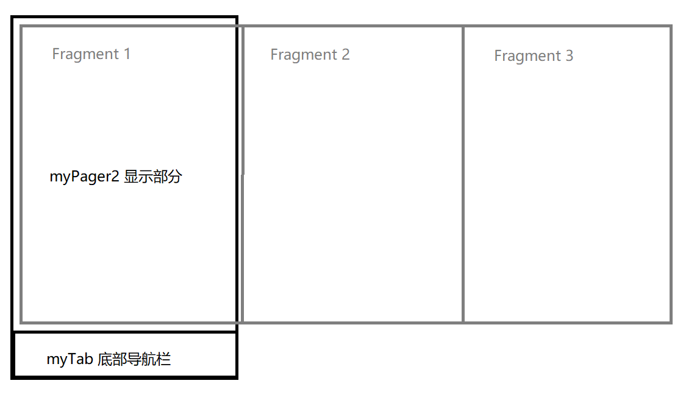

# BottomNavigation Demo

## 简介

这是一个 Android 底部导航栏的示例程序，由于官方的 BottomNavigation 我实在是看不懂，所以写了一个这个简单的底部导航栏作为 demo 示例，便于后面直接拿来改改就用。

## 讲解

首先根据 `manifests\AndroidManifest.xml` 可知，首先进入 `MainActivity` 文件的界面。

而在 `MainActivity` 中，有这些关键概念：

1. myTab

    myTab 其实就是底部导航栏，在 `res\layout\activity_main.xml` 中可以看到

2. myPager2

   myPager2 其实就是导航栏上面的显示界面，在 `res\layout\activity_main.xml` 中可以看到

3. titles

    底部导航栏里面每一项的文字说明

4. icons

    底部导航栏中每一项的图标，可以右键 `res\drawable` 选择 `New` - `Vector Asset` 来添加

5. fragments

    对应位置在 `Fragments` 中，fragments 显示的位置在 myPager2 的位置上。当底部导航栏切换，实际上是 myPager2 的位置切换对应的 fragments

6. sectionsPageAdapter

    不用管，固定这个写法就行

7. TabLayoutMediator

    不用管，固定这个写法就行

示意图：

fragments 其实是依托于 myPager2 来显示的，下面的 myTab 切换导航栏时，上面的 myPager2 部分对应的切换显示的 fragment

## 如何修改

如果要添加切换的界面，直接照葫芦画瓢在 `Fragments` 中添加一个 fragment，然后给这个页面一个对应的 layout xml 文件，再在 `MainActivity` 中对应加上即可。

要注意 fragment 页面的写法和 `MainActivity` 文件的不同：

1. 加了 `context = mainView.getContext()`

    这是因为 `MainActivity` 中 context 被默认的 this 代替了，而 fragment 中没有 this，必须定义一个界面的 context

2. findViewById()

    在 `MainActivity` 中可以直接调用，是因为省略了前面的 this，在 fragment 中必须使用 mainView.findViewById()

3. Toast.makeText()

    在 fragment 中要传入 context 参数，原因前面已经解释了

## 参考资料

[【安卓】底部导航栏最简实现与应用](https://www.bilibili.com/video/BV1Jg411V7EA/?spm_id_from=333.337.search-card.all.click&vd_source=145390bc56084552ecc0a576248fd1a1)